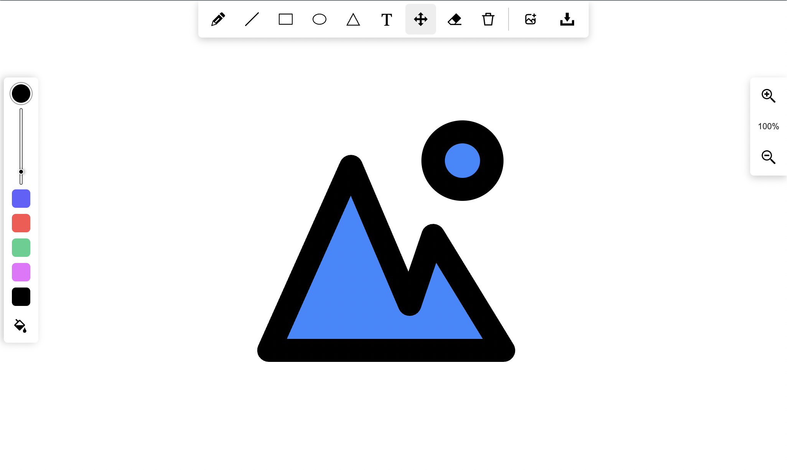

# React Whiteboard PDF

A powerful **React virtual whiteboard** built with **Fabric.js** that supports drawing, annotations, PDF import, image upload, zooming, and canvas state management.

It is designed for educational platforms, collaborative applications, digital classrooms, document annotation, and interactive whiteboard solutions.



---

## 🚀 Live Demo

**Demo:** https://statuesque-muffin-fb224e.netlify.app/

---

# Features

- ✏️ Freehand drawing
- 📄 Import PDF documents
- 🖼️ Upload images
- 🔲 Draw shapes (Rectangle, Triangle, Ellipse, Line)
- 📝 Add text annotations
- 🎨 Color picker
- 🖌️ Adjustable brush size
- 🩹 Eraser tool
- 🔍 Zoom in/out
- 💾 Export canvas as image
- 📂 Save & restore canvas using JSON
- 📑 Multi-page PDF support
- ⚡ Built with Fabric.js for high-performance canvas rendering

---

# Technologies Used

- React 17+
- Fabric.js
- React PDF
- Styled Components
- Sass
- File Saver
- Babel

---

# Compatibility

- React 17 or later

---

# Installation

Using npm:

```bash
npm install react-whiteboard-pdf
```

Using Yarn:

```bash
yarn add react-whiteboard-pdf
```

---

# Basic Usage

```jsx
import { Whiteboard } from "react-whiteboard-pdf";

function App() {
  return (
    <div>
      <Whiteboard />
    </div>
  );
}

export default App;
```

---

# Advanced Usage

The component supports customization through several configuration objects.

```jsx
import { Whiteboard } from "react-whiteboard-pdf";

function App() {
  return (
    <Whiteboard
      drawingSettings={{
        brushWidth: 5,
        background: false,
        currentColor: "#000000",
        fill: false
      }}
      controls={{
        PENCIL: true,
        LINE: true,
        RECTANGLE: true,
        ELLIPSE: true,
        TRIANGLE: true,
        TEXT: true,
        SELECT: true,
        ERASER: true,
        CLEAR: true,
        FILL: true,
        BRUSH: true,
        COLOR_PICKER: true,
        DEFAULT_COLORS: true,
        FILES: true,
        SAVE_AS_IMAGE: true,
        ZOOM: true
      }}
      settings={{
        zoom: 1,
        minZoom: 0.05,
        maxZoom: 9.99,
        contentJSON: null
      }}
      fileInfo={{
        file: { name: "Document" },
        totalPages: 1,
        currentPageNumber: 0,
        currentPage: ""
      }}
      onObjectAdded={(data, event, canvas) => {}}
      onObjectRemoved={(data, event, canvas) => {}}
      onZoom={(data, event, canvas) => {}}
      onImageUploaded={(data, event, canvas) => {}}
      onPDFUploaded={(data, event, canvas) => {}}
      onPDFUpdated={(data, event, canvas) => {}}
      onPageChange={(data, event, canvas) => {}}
      onOptionsChange={(data, event, canvas) => {}}
      onSaveCanvasAsImage={(data, event, canvas) => {}}
      onConfigChange={(data, event, canvas) => {}}
      onSaveCanvasState={(data, event,canvas) => {}}
    />
  );
}

export default App;
```

---

# Configuration

## Drawing Settings

| Property | Type | Default | Description |
|----------|------|---------|-------------|
| brushWidth | Number | 5 | Brush size |
| background | Boolean | false | Display dotted background |
| currentColor | String | #000000 | Active drawing color |
| fill | Boolean | false | Fill shapes with current color |

---

## Controls

Enable or disable individual toolbar buttons.

Available controls include:

- PENCIL
- LINE
- RECTANGLE
- ELLIPSE
- TRIANGLE
- TEXT
- SELECT
- ERASER
- CLEAR
- FILL
- BRUSH
- COLOR_PICKER
- DEFAULT_COLORS
- FILES
- SAVE_AS_IMAGE
- ZOOM

---

## Settings

| Property | Description |
|-----------|-------------|
| zoom | Initial zoom level |
| minZoom | Minimum zoom |
| maxZoom | Maximum zoom |
| contentJSON | Restore saved canvas state |

---

## Event Callbacks

The Whiteboard component provides several callback functions:

```jsx
onObjectAdded()
onObjectRemoved()
onZoom()
onImageUploaded()
onPDFUploaded()
onPDFUpdated()
onPageChange()
onOptionsChange()
onSaveCanvasAsImage()
onConfigChange()
onSaveCanvasState()
```

Each callback receives:

```jsx
(data, event, canvas)
```

allowing complete access to the Fabric.js canvas instance.

---

# Development

Clone the repository:

```bash
git clone https://github.com/HetalRupareliya91/white-sketchboard.git
```

Navigate to the project:

```bash
cd white-sketchboard
```

Install dependencies:

```bash
npm install
```

Start the development server:

```bash
npm start
```

Build the application:

```bash
npm run build
```

Build the distributable npm package:

```bash
npm run build-npm
```

Run tests:

```bash
npm test
```

---

# Project Structure

```
src/
│
├── lib/
├── components/
├── styles/
└── index.js

dist/

README.md
package.json
```

---

# License

This project is licensed under the **MIT License**.

---

# Author

**Oleg Spiridonov**

https://github.com/spiridonov-oa

---

# Contributors

Thanks to everyone who has contributed to this project.

- rodionspi
